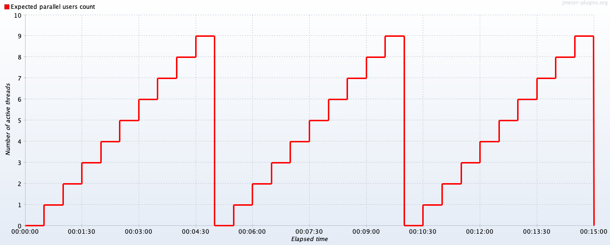
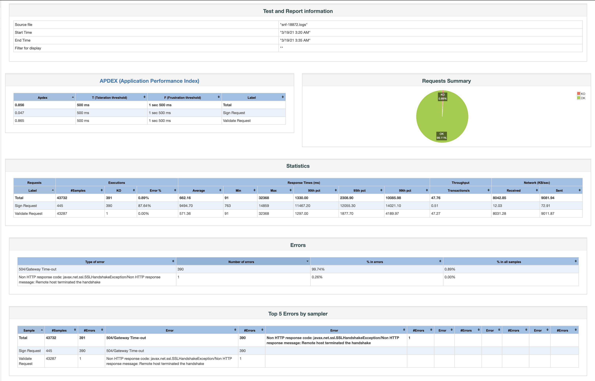

## Stress Test Report

The stress test was executed on High Availability setup consisted of a load balancer that was sharing the requests
between two machines. The [Remote Signing](signing.md#post---sign-a-pdf-document) and [Validation](validation.md) of pdf document were tested, and the 
duration of stress test was 15 minutes.

### Signing Test Plan

Below the test plan of [Remote Signing endpoint](signing.md#request) is presented. In the following graph, we can see the number of active threads
over time.

### Validation Test Plan

Below the test plan of [Validation endpoint](validation.md#request) is presented. In the following graph, we can see the number of active 
threads over time.

### Stress Test Results

The above test plans were executed by two clients simultaneously. You can find below the results of the described 
testing process.

