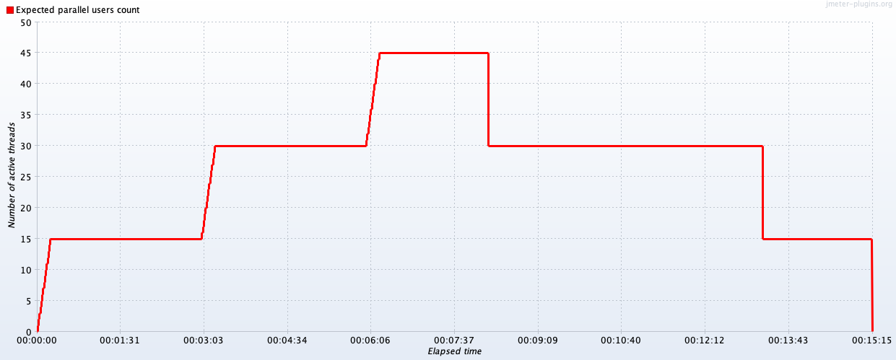
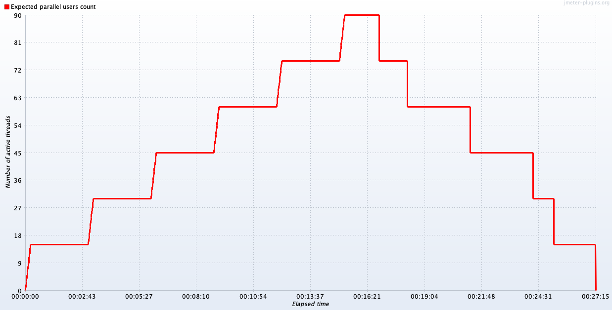
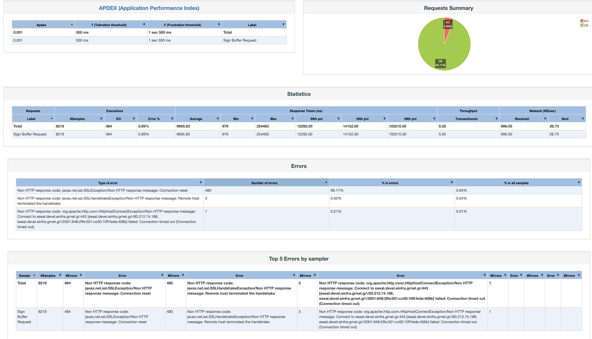

## Stress Test Report

### Stress Test of Remote Signing and Validation

The stress test was executed on High Availability setup consisted of a load balancer that was sharing the requests
between two machines. The [Remote Signing](signing.md#post---sign-a-pdf-document) and [Validation](validation.md) of pdf document were tested, and the 
duration of stress test was 15 minutes.

#### Signing Test Plan

Below the test plan of [Remote Signing endpoint](signing.md#request) is presented. In the following graph, we can see the number of active threads
over time.

#### Validation Test Plan

Below the test plan of [Validation endpoint](validation.md#request) is presented. In the following graph, we can see the number of active 
threads over time.

#### Stress Test Results

The above test plans were executed by two clients simultaneously. You can find below the results of the described 
testing process.

### Stress Test of Remote Signing Detached

The stress test was executed on High Availability setup consisted of a load balancer that was sharing the requests
between two machines. The [Remote Signing Detached](signing.md#post---sign-a-pdf-document-detached) of pdf document was tested, and the
duration of stress test was 27 minutes.

#### Signing Detached Test Plan

Below the test plan of [Remote Signing Detached endpoint](signing.md#request-1) is presented. In the following graph, we can see the number of active threads
over time.

#### Stress Test Results

The above test plan was executed by one client. You can find below the results of the described
testing process.

